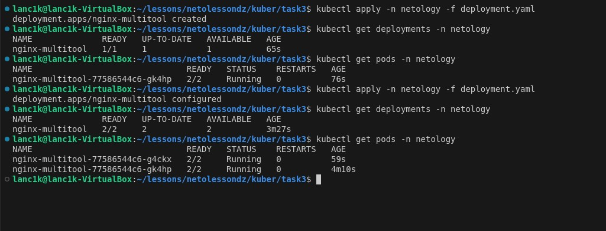
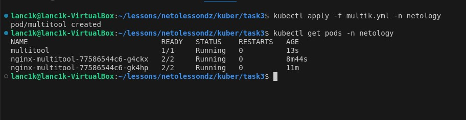

# Домашнее задание к занятию «Запуск приложений в K8S»

### Задание 1. Создать Deployment и обеспечить доступ к репликам приложения из другого Pod

1. Создать Deployment приложения, состоящего из двух контейнеров — nginx и multitool. Решить возникшую ошибку.
2. После запуска увеличить количество реплик работающего приложения до 2.
3. Продемонстрировать количество подов до и после масштабирования.
4. Создать Service, который обеспечит доступ до реплик приложений из п.1.
5. Создать отдельный Pod с приложением multitool и убедиться с помощью curl, что из пода есть доступ до приложений из п.1.

### Решение

1. Для работы создан отдельный namespace 


2. Написан манифест для создания Deployment с двумя контейнерами nginx и multitool. Т.к. multitool использует nginx задан альтернативный порт для решения проблемы конфликта по портам.

Манифест:

```yaml
apiVersion: apps/v1
kind: Deployment
metadata:
  name: nginx-multitool
spec:
  selector:
    matchLabels:
      app: multik
  replicas: 1
  template:
    metadata:
      labels:
        app: multik
    spec:
      containers:
        - name: nginx
          image: nginx:1.27.0
          ports:
            - containerPort: 80
        - name: multitool
          image: wbitt/network-multitool
          ports:
            - containerPort: 8080
          env:
            - name: HTTP_PORT
              value: "1180"

```

Результат запуска Deployment


3. Согласно заданию количество реплик увеличено с `1` до `2` путём изменения параметра `replicas` и повторного применения манифеста. Количество Pod`ов увеличилось до двух.


4. Создан манифест с разворачиванием сервиса `nginx-multitool-svc`

```yaml
apiVersion: v1
kind: Service
metadata:
  name: nginx-multitool-svc
  namespace: netology
spec:
  selector:
    app: multik
  ports:
    - protocol: TCP
      name: nginx
      port: 80
      targetPort: 80
    - protocol: TCP
      name: multitool
      port: 8080
      targetPort: 1180

```


5. Создан отдельный Pod с приложением multitool и произведена проверка с помощью curl, что из пода есть доступ до приложений из п.1

```yaml
apiVersion: v1
kind: Pod
metadata:
  name: multitool
spec:
  containers:
    - name: multitool
      image: wbitt/network-multitool
      ports:
        - containerPort: 8080
```

Деплой Pod`а

Curl до nginx из п.1

Curl до multitool из п.1


### Задание 2. Создать Deployment и обеспечить старт основного контейнера при выполнении условий

1. Создан манифест Deployment приложения nginx, который запустится только после запуска сервиса. В качестве Init-контейнера используется busybox:

```yaml
apiVersion: apps/v1
kind: Deployment
metadata:
  name: nginx-init
spec:
  selector:
    matchLabels:
      app: nginx-init
  replicas: 1
  template:
    metadata:
      labels:
        app: nginx-init
    spec:
      containers:
        - name: nginx
          image: nginx:1.27.0
          ports:
            - containerPort: 80
      initContainers:
        - name: delay
          image: busybox
          command:
            [
              "sh",
              "-c",
              "until nslookup nginx-init-svc.$(cat /var/run/secrets/kubernetes.io/serviceaccount/namespace).svc.cluster.local; do echo waiting for nginx-init-svc; sleep 2; done",
            ]
```


2. Создан и запущен манифест Service с последующей проверкой состояния Pod`а

```yaml
apiVersion: v1
kind: Service
metadata:
  name: nginx-init-svc
spec:
  ports:
    - name: nginx-init
      port: 80
  selector:
    app: nginx-init
```


После запуска сервиса состояние пода перешло в статус `Running`