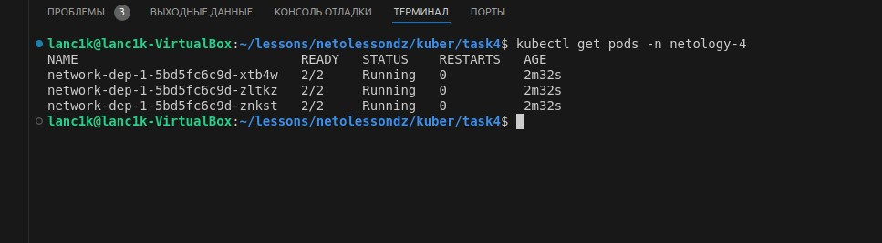
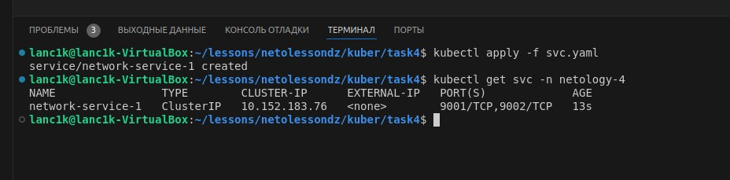
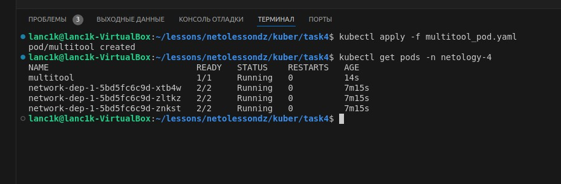
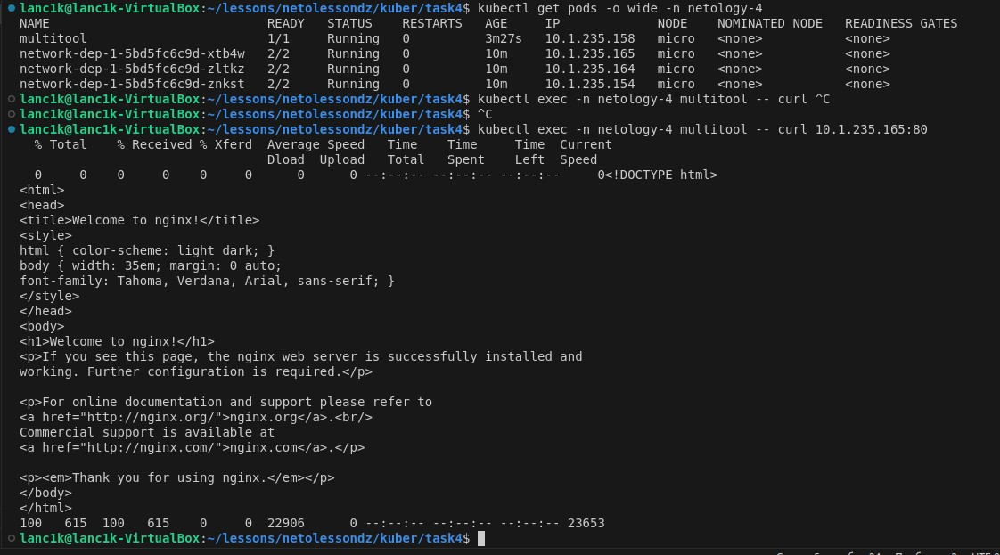
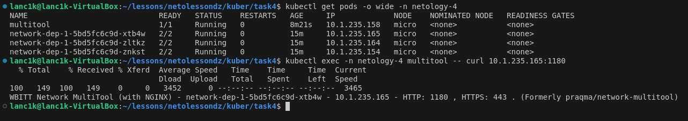
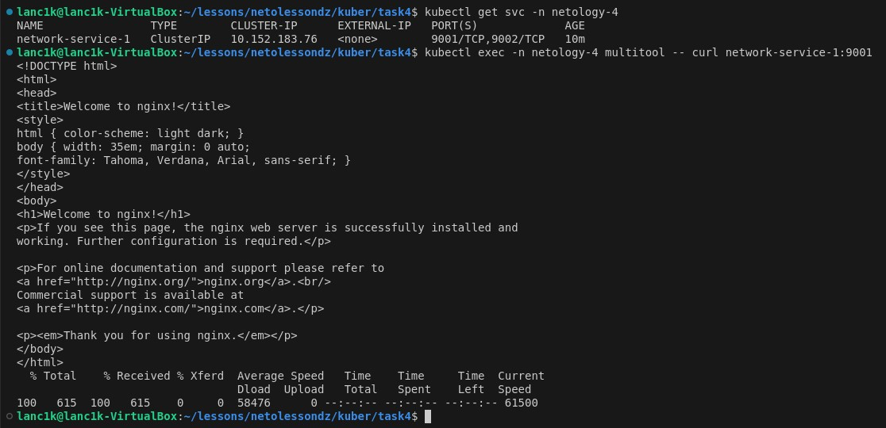
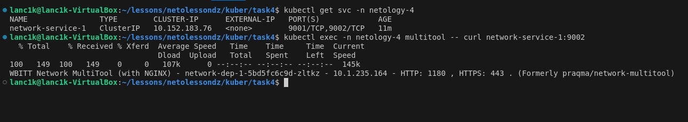
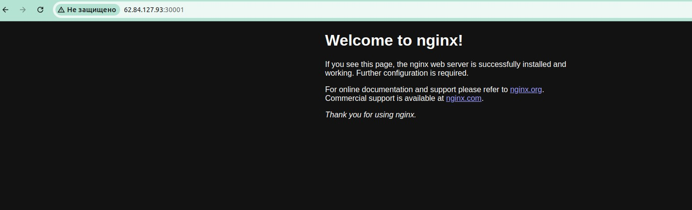
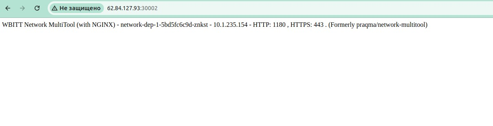

# Домашнее задание к занятию «Сетевое взаимодействие в K8S. Часть 1»

### Задание 1. Создать Deployment и обеспечить доступ к контейнерам приложения по разным портам из другого Pod внутри кластера

1. Создал Deployment приложения, состоящего из двух контейнеров (nginx и multitool), с количеством реплик 3 шт.



```yaml
apiVersion: apps/v1
kind: Deployment
metadata:
  name: network-dep-1
  namespace: netology-4
spec:
  selector:
    matchLabels:
      app: netdep
  replicas: 3
  template:
    metadata:
      labels:
        app: netdep
    spec:
      containers:
        - name: nginx
          image: nginx:1.27.0
          ports:
            - containerPort: 80
        - name: multitool
          image: wbitt/network-multitool
          ports:
            - containerPort: 8080
          env:
            - name: HTTP_PORT
              value: "1180"
```

2. Создал Service, который обеспечивает доступ внутри кластера до контейнеров приложения из п.1 по порту 9001 — nginx 80, по 9002 — multitool 8080.



```yaml
apiVersion: v1
kind: Service
metadata:
  name: network-service-1
  namespace: netology-4
spec:
  selector:
    app: netdep
  ports:
    - protocol: TCP
      name: nginx
      port: 9001
      targetPort: 80
    - protocol: TCP
      name: multitool
      port: 9002
      targetPort: 1180
```

3. Создал отдельный Pod с приложением multitool и убедился с помощью `curl`, что из пода есть доступ до приложения из п.1 по разным портам в разные контейнеры.



```yaml
apiVersion: v1
kind: Pod
metadata:
  name: multitool
  namespace: netology-4
spec:
  containers:
    - name: multitool
      image: wbitt/network-multitool
      ports:
        - containerPort: 8080
```

`curl` до подов из п.1

Nginx

Multitool


4. Lоступ с помощью `curl` по доменному имени сервиса через порты

Nginx

Multitool


### Задание 2. Создать Service и обеспечить доступ к приложениям снаружи кластера

1. Создал отдельный Service приложения из Задания 1 с возможностью доступа снаружи кластера к nginx, используя тип NodePort.


```yaml
apiVersion: v1
kind: Service
metadata:
  name: svc-nodeport
  namespace: netology-4
spec:
  type: NodePort
  selector:
    app: netdep
  ports:
    - port: 80
      name: nginx-port
      targetPort: 80
      nodePort: 30001
    - port: 8080
      name: multitool-port
      targetPort: 1180
      nodePort: 30002
```

2. Доступ через браузер с локального ПК через связку IP:Port

Nginx

Multitool
