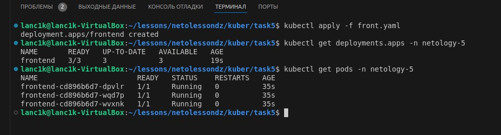
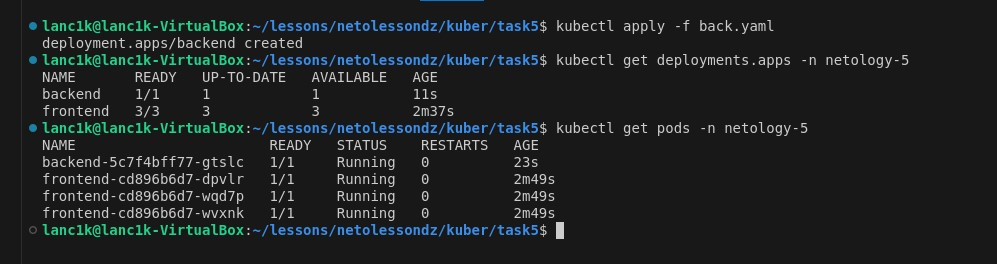
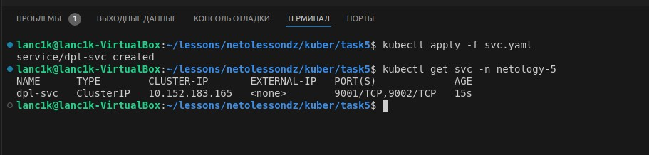
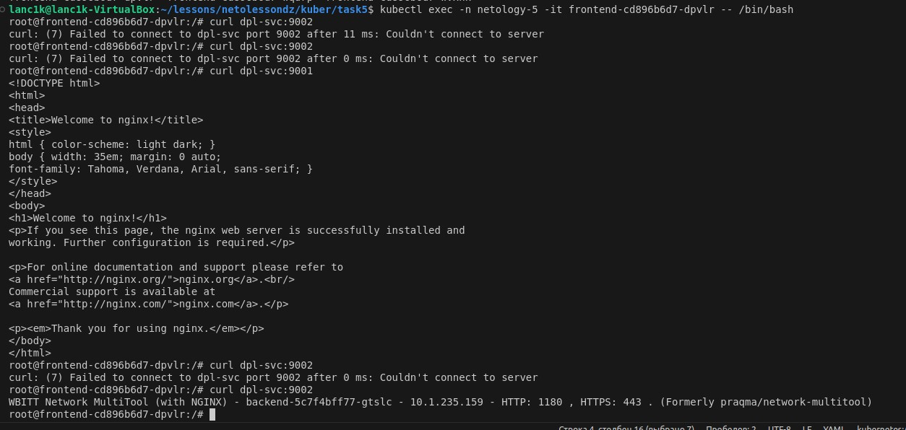
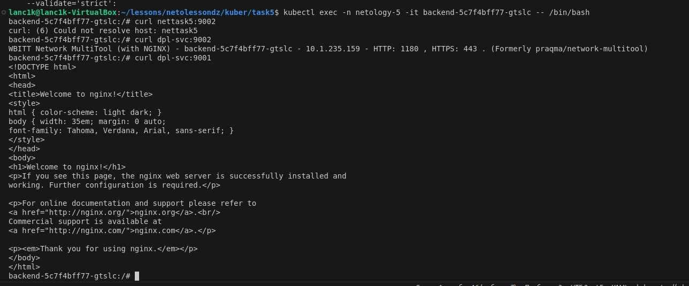
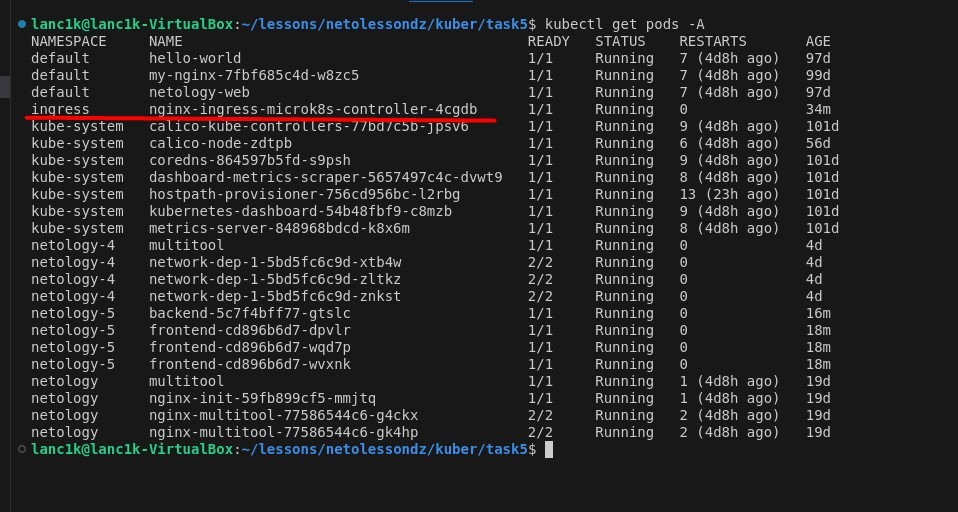
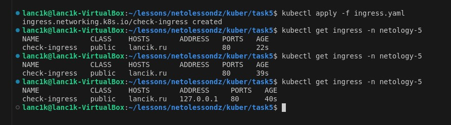
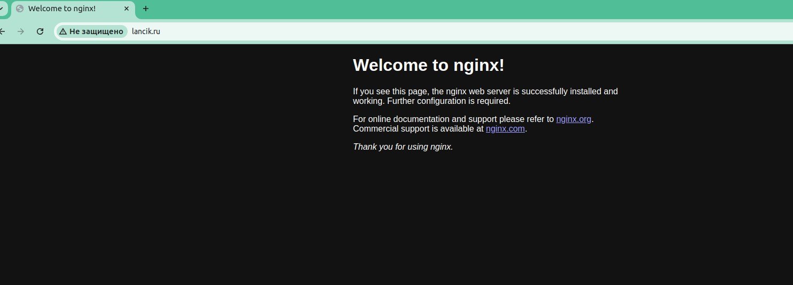
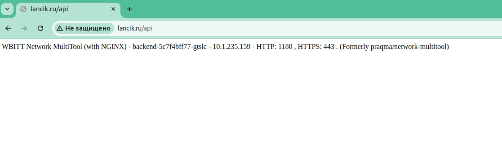

# Домашнее задание к занятию «Сетевое взаимодействие в K8S. Часть 2»

### Задание 1. Создать Deployment приложений backend и frontend

1. Создал Deployment приложения frontend из образа nginx с количеством реплик 3 шт.



```yaml
apiVersion: apps/v1
kind: Deployment
metadata:
  name: frontend
  namespace: netology-5
  labels:
    app: front
spec:
  selector:
    matchLabels:
      app: front
  replicas: 3
  template:
    metadata:
      labels:
        app: front
        component: nettask5
    spec:
      containers:
        - name: nginx
          image: nginx:1.27.0
          ports:
            - containerPort: 80
```

2. Создал Deployment приложения backend из образа multitool.



```yaml
apiVersion: apps/v1
kind: Deployment
metadata:
  name: backend
  namespace: netology-5
  labels:
    app: back
spec:
  selector:
    matchLabels:
      app: back
  replicas: 1
  template:
    metadata:
      labels:
        app: back
        component: nettask5
    spec:
      containers:
        - name: multitool
          image: wbitt/network-multitool
          ports:
            - containerPort: 8080
          env:
            - name: HTTP_PORT
              value: "1180"
```

3. Добавил Service, который обеспечит доступ к обоим приложениям внутри кластера. Для сетевой связанности использовал метод `component:`



```yaml
apiVersion: v1
kind: Service
metadata:
  name: dpl-svc
  namespace: netology-5
  labels:
    component: nettask5
spec:
  selector:
    component: nettask5
  ports:
    - protocol: TCP
      name: nginx
      port: 9001
      targetPort: 80
    - protocol: TCP
      name: multitool
      port: 9002
      targetPort: 1180
```
4. Проверяю, что приложения видят друг друга через Service





### Задание 2. Создать Ingress и обеспечить доступ к приложениям снаружи кластера

1. Включил Ingress-controller в MicroK8S.



2. Создал Ingress, обеспечивающий доступ снаружи по IP-адресу кластера MicroK8S так, чтобы при запросе только по адресу открывался frontend а при добавлении /api - backend.



```yaml
apiVersion: networking.k8s.io/v1
kind: Ingress
metadata:
  name: check-ingress
  namespace: netology-5
  annotations:
    nginx.ingress.kubernetes.io/rewrite-target: /
spec:
  rules:
    - host: lancik.ru
      http:
        paths:
          - path: /
            pathType: Prefix
            backend:
              service:
                name: dpl-svc
                port:
                  number: 9001
          - path: /api
            pathType: Prefix
            backend:
              service:
                name: dpl-svc
                port:
                  number: 9002
```

3. Доступ через DNS в браузере с локального ПК





-----
Манифесты размещены в [каталоге](https://github.com/VladimirEremenko-web/devops-netology/tree/main/kuber-homeworks/1-5/configs).