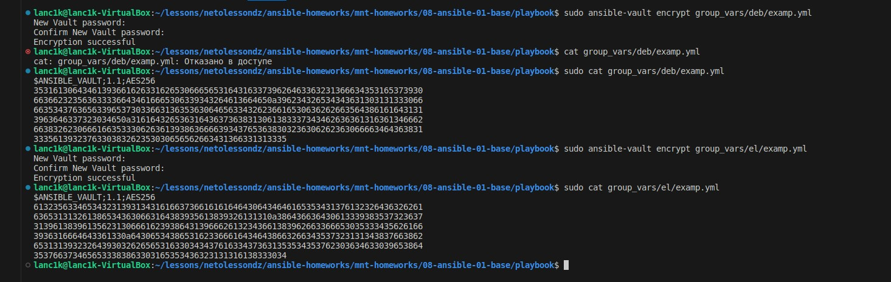

## 1. Попробуйте запустить playbook на окружении из `test.yml`, зафиксируйте значение, которое имеет факт `some_fact` для указанного хоста при выполнении playbook.

Значение `some_fact` 12

## 2. Найдите файл с переменными (group_vars), в котором задаётся найденное в первом пункте значение, и поменяйте его на `all default fact`.

## 3. Воспользуйтесь подготовленным (используется `docker`) или создайте собственное окружение для проведения дальнейших испытаний.

## 4. Проведите запуск playbook на окружении из `prod.yml`. Зафиксируйте полученные значения `some_fact` для каждого из `managed host`.

1. Значение `some_fact` для managed host "ubuntu" `deb`.
2. Значение `some_fact` для managed host "centos7" `el`.

## 5. Добавьте факты в `group_vars` каждой из групп хостов так, чтобы для `some_fact` получились значения: для `deb` — `deb default fact`, для `el` — `el default fact`.

## 6. Повторите запуск playbook на окружении `prod.yml`. Убедитесь, что выдаются корректные значения для всех хостов.

1. Значение `some_fact` для managed host "ubuntu" `deb default fact`.
2. Значение `some_fact` для managed host "centos7" `el default fact`.

## 7. При помощи `ansible-vault` зашифруйте факты в `group_vars/deb` и `group_vars/el` с паролем `netology`.

## 8. Запустите playbook на окружении `prod.yml`. При запуске ansible должен запросить у вас пароль. Убедитесь в работоспособности.

## 9. Посмотрите при помощи `ansible-doc` список плагинов для подключения. Выберите подходящий для работы на `control node`.

## 10. В `prod.yml` добавьте новую группу хостов с именем `local`, в ней разместите `localhost` с необходимым типом подключения.

## 11. Запустите playbook на окружении `prod.yml`. При запуске ansible должен запросить у вас пароль. Убедитесь, что факты `some_fact` для каждого из хостов определены из верных `group_vars`.

1. Значение `some_fact` для managed host "ubuntu" `deb default fact`.
2. Значение `some_fact` для managed host "centos7" `el default fact`.
3. Значение `some_fact` для managed host "localhost" `all default fact`.