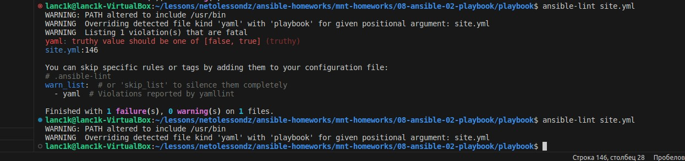
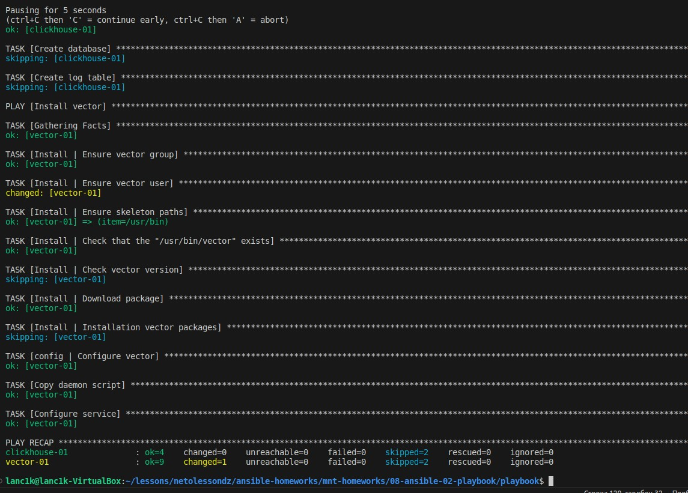
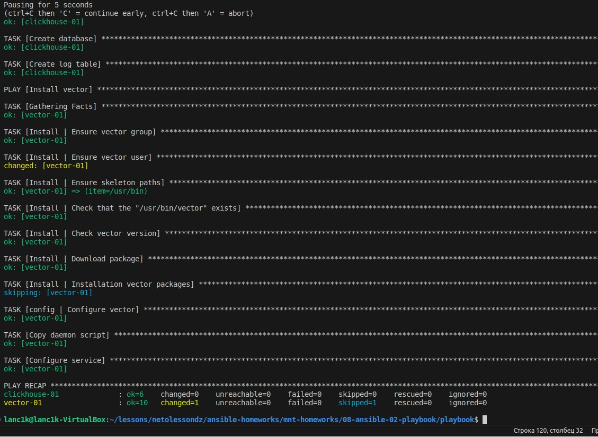
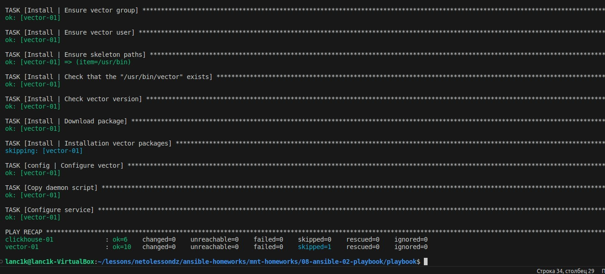

# Домашнее задание к занятию 2 «Работа с Playbook»

## Описание проекта

1. Инфраструктура проекта:
 - Сервер `clickhouse-01` служит для установки и эксплуатации БД
 - Сервер `vector-01` - развёрнут vector.service для сбора и обработки логов с последующей отправкой в БД на сервере `clickhouse-01`

2. Playbook

- ### Clickhouse

  - Скачивание пакетов и установка `clickhouse`
  - создание базы данных и таблицы в ней

- ### Vector

  - Создание группы пользователей
  - Создание пользователя
  - Создание путей для исполняемых файлов
  - Проверка корректности путей
  - Проверка версии Vector
  - Скачивание и установка Vector
  - Подстановка шаблонов файлов конфигурации

3. Variables

В папке group_vars созданы файлы с переменными для `clickhouse-01` и `vector-01`

> Задание №5. Запуск ansible-lint site.yml

> Задание №6. Попробуйте запустить playbook на этом окружении с флагом --check

> Задание №7. Запустите playbook на prod.yml окружении с флагом --diff. Убедитесь, что изменения на системе произведены.

> Задание №8. Повторно запустите playbook с флагом --diff и убедитесь, что playbook идемпотентен.

