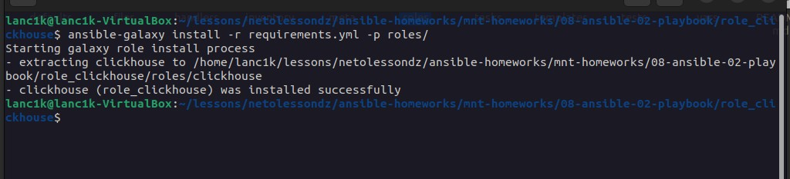
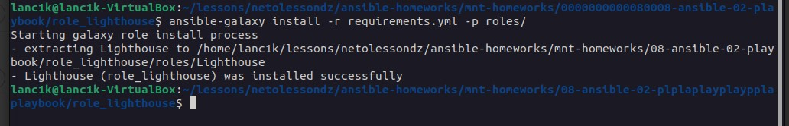
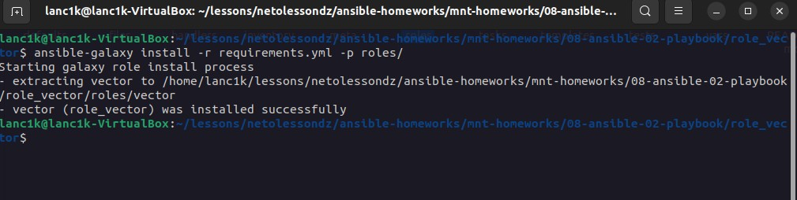

# Домашнее задание к занятию 4 «Работа с roles»

## Созданы `requirements.yml` для скачивания роли

1. Clickhouse

```
---
- name: clickhouse
  src: git@github.com:VladimirEremenko-web/devops-netology.git
  scm: git
  version: role_clickhouse

```

2. LightHouse

```
---
- name: Lighthouse
  src: git@github.com:VladimirEremenko-web/devops-netology.git
  scm: git
  version: role_lighthouse

```

3. Vector

```
---
- name: vector
  src: git@github.com:VladimirEremenko-web/devops-netology.git
  scm: git
  version: role_vector

```

## Скачивание ролей через `ansible-galaxy`

1. Clickhouse



2. Lighthouse



3. Vector



## Ссылки на ветки с roles (папки с playbook в корне задания)

1. Clickhouse - https://github.com/VladimirEremenko-web/devops-netology/tree/role_clickhouse/mnt-homeworks/08-ansible-04-role

2. Lighthouse - https://github.com/VladimirEremenko-web/devops-netology/tree/role_lighthouse/mnt-homeworks/08-ansible-04-role

3. Vector - https://github.com/VladimirEremenko-web/devops-netology/tree/role_vector/mnt-homeworks/08-ansible-04-role