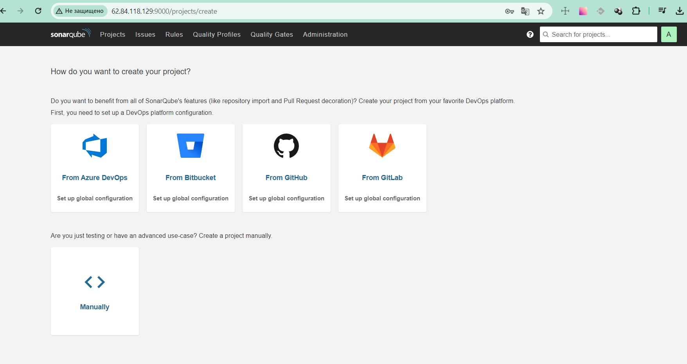
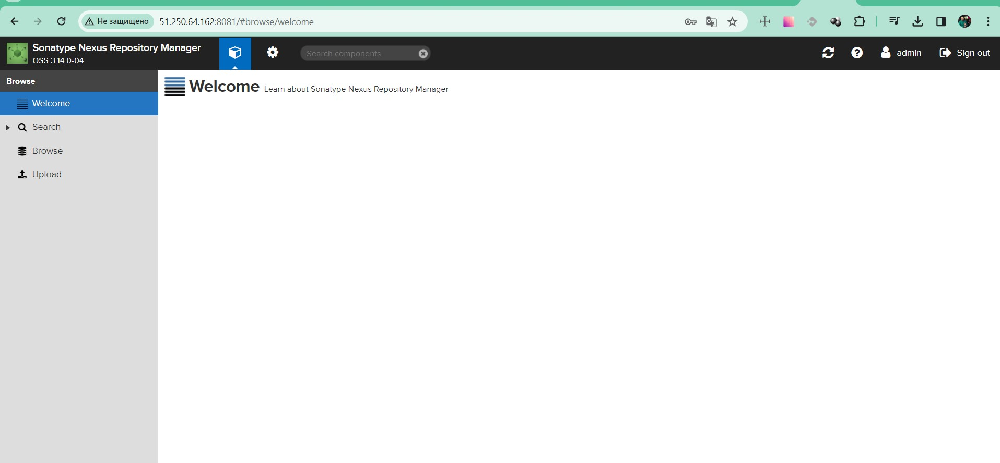
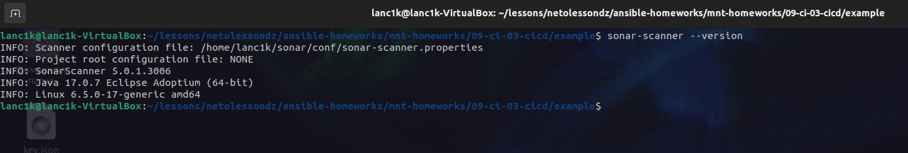
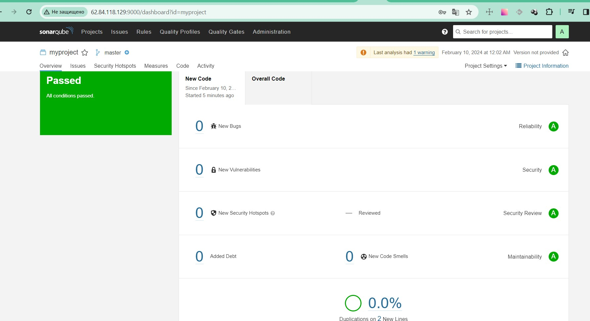
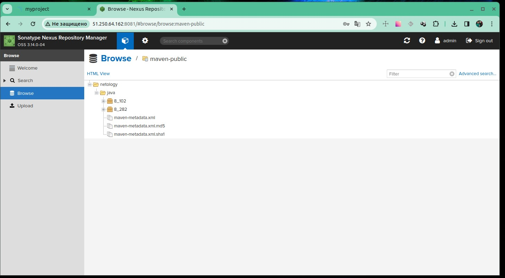
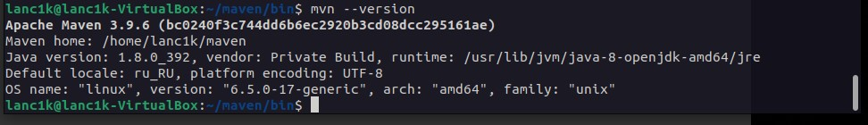
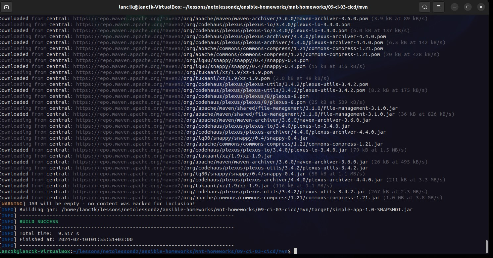
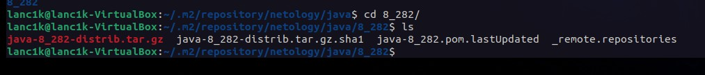

# Домашнее задание к занятию 9 «Процессы CI/CD»

## Подготовка к выполнению

> SonarQube в браузере



> Nexus в браузере



## Знакомоство с SonarQube

1.  `sonar-scanner --version`



2.  Ошибки исправлены



## Знакомство с Nexus

1. Загруженные артефакты с GAV-параметрами в `maven-public`



2. Файл `maven-metadata.xml`

```xml
This XML file does not appear to have any style information associated with it. The document tree is shown below.
<metadata modelVersion="1.1.0">
  <groupId>netology</groupId>
  <artifactId>java</artifactId>
  <versioning>
    <latest>8_282</latest>
    <release>8_282</release>
    <versions>
      <version>8_102</version>
      <version>8_282</version>
    </versions>
    <lastUpdated>20240209212446</lastUpdated>
  </versioning>
</metadata>
```
## Знакомство с Maven

### Подготовка к выполнению

> Apache Maven установлен и настроен



### Основная часть

1. Изменённый `pom.xml`

```xml
<project xmlns="http://maven.apache.org/POM/4.0.0" xmlns:xsi="http://www.w3.org/2001/XMLSchema-instance"
  xsi:schemaLocation="http://maven.apache.org/POM/4.0.0 http://maven.apache.org/xsd/maven-4.0.0.xsd">
  <modelVersion>4.0.0</modelVersion>
 
  <groupId>com.netology.app</groupId>
  <artifactId>simple-app</artifactId>
  <version>1.0-SNAPSHOT</version>
   <repositories>
    <repository>
      <id>my-repo</id>
      <name>maven-public</name>
      <url>http://51.250.64.162:8081/repository/maven-public/</url>
    </repository>
  </repositories>
  <dependencies>
    <dependency>
      <groupId>netology</groupId>
      <artifactId>java</artifactId>
      <version>8_282</version>
      <classifier>distrib</classifier>
      <type>tar.gz</type>
    </dependency>
  </dependencies>
</project>
```

2. Запуск `mvn package` в директории с `pom.xml`



3. В директории `~/.m2/repository/netology/java/8_282` лежит мой артефакт

