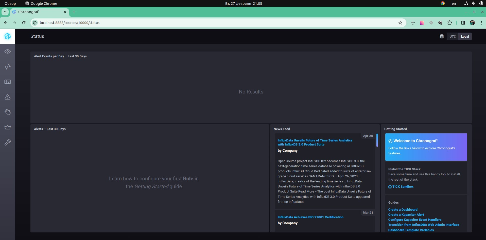
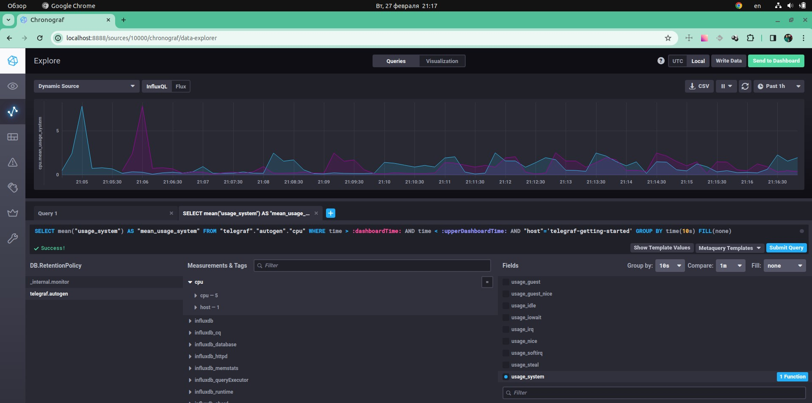
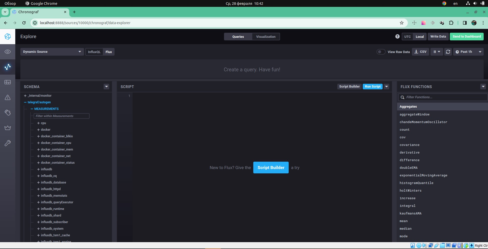

# Домашнее задание к занятию "13.Системы мониторинга"

## Обязательные задания

1. Вас пригласили настроить мониторинг на проект. На онбординге вам рассказали, что проект представляет из себя платформу для вычислений с выдачей текстовых отчетов, которые сохраняются на диск. Взаимодействие с платформой осуществляется по протоколу http. Также вам отметили, что вычисления загружают ЦПУ. Какой минимальный набор метрик вы выведите в мониторинг и почему?

 - CPU utilization - загруженность процессора
 - Memory utilization - процент используемой оперативной памяти (RAM)
 - HDD - занятое место на диске
 - IOPS - важный параметр для мониторинга операций ввода/вывода
 - INODES - потребление всех inodes может блокировать создание новых файлов, возможна остановка системы.
 - HTTP - доступность, коды ответов и ошибок
 - Network - нагруженность сетевого трафика

2. Менеджер продукта посмотрев на ваши метрики сказал, что ему непонятно что такое RAM/inodes/CPUla. Также он сказал, что хочет понимать, насколько мы выполняем свои обязанности перед клиентами и какое качество обслуживания. Что вы можете ему предложить?

> Предложить подход настройки мониторинга с метриками SLO, SLA и SLI. Это позволит связать сначения мониторинга связать с бизнес-состовляющей

3. Вашей DevOps команде в этом году не выделили финансирование на построение системы сбора логов. Разработчики в свою очередь хотят видеть все ошибки, которые выдают их приложения. Какое решение вы можете предпринять в этой ситуации, чтобы разработчики получали ошибки приложения?

> Систему «Перехватчик ошибок»: Sentry

4. Вы, как опытный SRE, сделали мониторинг, куда вывели отображения выполнения SLA=99% по http кодам ответов. Вычисляете этот параметр по следующей формуле: summ_2xx_requests/summ_all_requests. Данный параметр не поднимается выше 70%, но при этом в вашей системе нет кодов ответа 5xx и 4xx. Где у вас ошибка?

> Не учитывались коды 3хх в данном случае правильная формула: (summ_2xx_requests + summ_2xx_requests)/(summ_all_requests)

5. Опишите основные плюсы и минусы pull и push систем мониторинга.

 > Плюсы
 - упрощение репликации данных в разные системы мониторинга или их резервные копии

 - более гибкая настройка отправки пакетов данных с метриками

  - UDP — это менее затратный способ передачи данных, из-за чего может возрасти производительность сбора метрик

> Минусы
 - легче контролировать подлинность данных
 - можно настроить единый proxy server до всех агентов с TLS
 - упрощённая отладка получения данных с агентов

6. Какие из ниже перечисленных систем относятся к push модели, а какие к pull? А может есть гибридные?

 - Prometheus - pull
 - TICK - push
 - Zabbix - pull&push
 - VictoriaMetrics - pull&push
 - Nagios - pull&push

7. Репозиторий склонирован и запущен ./sandbox up

 - веб-интерфейс

8. Утилизация CPU из веб интерфейса:

9. Cписок measurments в веб-интерфейсе базы telegraf.autogen с метриками docker

