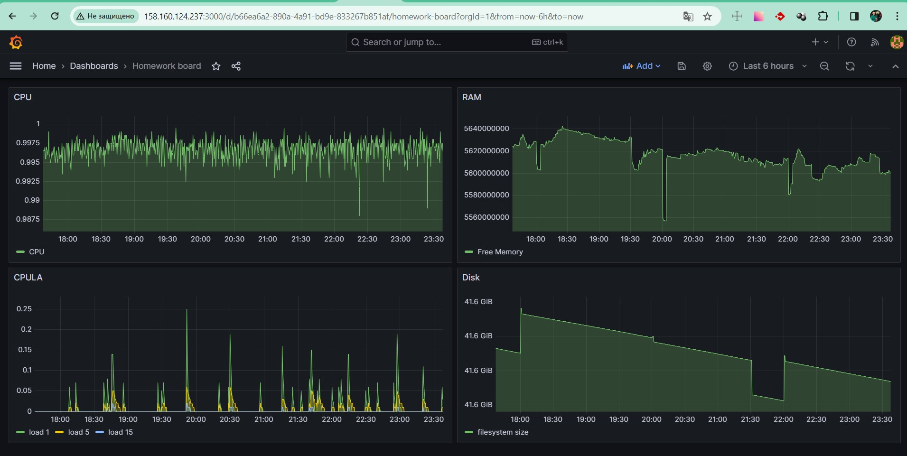

# Домашнее задание к занятию 14 «Средство визуализации Grafana»

1. Задание 1


2. Создайте Dashboard и в ней создайте Panels:

 - утилизация CPU для nodeexporter (в процентах, 100-idle);
 - CPULA 1/5/15;
 - количество свободной оперативной памяти;
 - количество места на файловой системе.



3. Создайте для каждой Dashboard подходящее правило alert 

> Dashboard с установленными правилами. На панели CPU значения правила специально занижены для срабатывания триггера


> Alert Rules


> Оповещение в Telegram через бота


4. Сохраните ваш Dashboard.Для этого перейдите в настройки Dashboard, выберите в боковом меню «JSON MODEL». Далее скопируйте отображаемое json-содержимое в отдельный файл и сохраните его.

<details>

<summary>JSON MODEL</summary>

```JSON
{
  "annotations": {
    "list": [
      {
        "builtIn": 1,
        "datasource": {
          "type": "grafana",
          "uid": "-- Grafana --"
        },
        "enable": true,
        "hide": true,
        "iconColor": "rgba(0, 211, 255, 1)",
        "name": "Annotations & Alerts",
        "type": "dashboard"
      }
    ]
  },
  "editable": true,
  "fiscalYearStartMonth": 0,
  "graphTooltip": 0,
  "id": 2,
  "links": [],
  "liveNow": false,
  "panels": [
    {
      "datasource": {
        "type": "prometheus",
        "uid": "ebebba02-b0e5-4e04-af69-4a41513b0145"
      },
      "fieldConfig": {
        "defaults": {
          "color": {
            "mode": "palette-classic"
          },
          "custom": {
            "axisBorderShow": false,
            "axisCenteredZero": false,
            "axisColorMode": "text",
            "axisLabel": "",
            "axisPlacement": "auto",
            "barAlignment": 0,
            "drawStyle": "line",
            "fillOpacity": 25,
            "gradientMode": "none",
            "hideFrom": {
              "legend": false,
              "tooltip": false,
              "viz": false
            },
            "insertNulls": false,
            "lineInterpolation": "linear",
            "lineWidth": 1,
            "pointSize": 5,
            "scaleDistribution": {
              "type": "linear"
            },
            "showPoints": "auto",
            "spanNulls": false,
            "stacking": {
              "group": "A",
              "mode": "none"
            },
            "thresholdsStyle": {
              "mode": "off"
            }
          },
          "mappings": [],
          "thresholds": {
            "mode": "absolute",
            "steps": [
              {
                "color": "green",
                "value": null
              },
              {
                "color": "red",
                "value": 80
              }
            ]
          },
          "unitScale": true
        },
        "overrides": []
      },
      "gridPos": {
        "h": 8,
        "w": 12,
        "x": 0,
        "y": 0
      },
      "id": 2,
      "options": {
        "legend": {
          "calcs": [],
          "displayMode": "list",
          "placement": "bottom",
          "showLegend": true
        },
        "tooltip": {
          "mode": "single",
          "sort": "none"
        }
      },
      "pluginVersion": "10.3.3",
      "targets": [
        {
          "datasource": {
            "type": "prometheus",
            "uid": "ebebba02-b0e5-4e04-af69-4a41513b0145"
          },
          "editorMode": "code",
          "exemplar": false,
          "expr": "avg without (cpu)(irate(node_cpu_seconds_total{job=\"node\",mode=\"idle\"}[1m]))",
          "format": "time_series",
          "instant": false,
          "interval": "",
          "legendFormat": "CPU",
          "range": true,
          "refId": "A"
        }
      ],
      "title": "CPU",
      "type": "timeseries"
    },
    {
      "datasource": {
        "type": "prometheus",
        "uid": "ebebba02-b0e5-4e04-af69-4a41513b0145"
      },
      "fieldConfig": {
        "defaults": {
          "color": {
            "mode": "palette-classic"
          },
          "custom": {
            "axisBorderShow": false,
            "axisCenteredZero": false,
            "axisColorMode": "text",
            "axisLabel": "",
            "axisPlacement": "auto",
            "barAlignment": 0,
            "drawStyle": "line",
            "fillOpacity": 25,
            "gradientMode": "none",
            "hideFrom": {
              "legend": false,
              "tooltip": false,
              "viz": false
            },
            "insertNulls": false,
            "lineInterpolation": "linear",
            "lineWidth": 1,
            "pointSize": 5,
            "scaleDistribution": {
              "type": "linear"
            },
            "showPoints": "auto",
            "spanNulls": false,
            "stacking": {
              "group": "A",
              "mode": "none"
            },
            "thresholdsStyle": {
              "mode": "off"
            }
          },
          "mappings": [],
          "thresholds": {
            "mode": "absolute",
            "steps": [
              {
                "color": "green",
                "value": null
              },
              {
                "color": "red",
                "value": 80
              }
            ]
          },
          "unit": "bytes",
          "unitScale": true
        },
        "overrides": []
      },
      "gridPos": {
        "h": 8,
        "w": 12,
        "x": 12,
        "y": 0
      },
      "id": 3,
      "options": {
        "legend": {
          "calcs": [],
          "displayMode": "list",
          "placement": "bottom",
          "showLegend": true
        },
        "tooltip": {
          "mode": "single",
          "sort": "none"
        }
      },
      "targets": [
        {
          "datasource": {
            "type": "prometheus",
            "uid": "ebebba02-b0e5-4e04-af69-4a41513b0145"
          },
          "editorMode": "code",
          "expr": "node_memory_MemFree_bytes{job='node'}",
          "instant": false,
          "legendFormat": "Free Memory",
          "range": true,
          "refId": "A"
        }
      ],
      "title": "RAM",
      "type": "timeseries"
    },
    {
      "datasource": {
        "type": "prometheus",
        "uid": "ebebba02-b0e5-4e04-af69-4a41513b0145"
      },
      "fieldConfig": {
        "defaults": {
          "color": {
            "mode": "palette-classic"
          },
          "custom": {
            "axisBorderShow": false,
            "axisCenteredZero": false,
            "axisColorMode": "text",
            "axisLabel": "",
            "axisPlacement": "auto",
            "barAlignment": 0,
            "drawStyle": "line",
            "fillOpacity": 25,
            "gradientMode": "none",
            "hideFrom": {
              "legend": false,
              "tooltip": false,
              "viz": false
            },
            "insertNulls": false,
            "lineInterpolation": "linear",
            "lineWidth": 1,
            "pointSize": 5,
            "scaleDistribution": {
              "type": "linear"
            },
            "showPoints": "auto",
            "spanNulls": false,
            "stacking": {
              "group": "A",
              "mode": "none"
            },
            "thresholdsStyle": {
              "mode": "off"
            }
          },
          "mappings": [],
          "thresholds": {
            "mode": "absolute",
            "steps": [
              {
                "color": "green",
                "value": null
              },
              {
                "color": "red",
                "value": 80
              }
            ]
          },
          "unitScale": true
        },
        "overrides": []
      },
      "gridPos": {
        "h": 8,
        "w": 12,
        "x": 0,
        "y": 8
      },
      "id": 1,
      "options": {
        "legend": {
          "calcs": [],
          "displayMode": "list",
          "placement": "bottom",
          "showLegend": true
        },
        "tooltip": {
          "mode": "single",
          "sort": "none"
        }
      },
      "targets": [
        {
          "datasource": {
            "type": "prometheus",
            "uid": "ebebba02-b0e5-4e04-af69-4a41513b0145"
          },
          "disableTextWrap": false,
          "editorMode": "builder",
          "expr": "node_load1{job=\"node\"}",
          "fullMetaSearch": false,
          "includeNullMetadata": true,
          "instant": false,
          "legendFormat": "load 1",
          "range": true,
          "refId": "A",
          "useBackend": false
        },
        {
          "datasource": {
            "type": "prometheus",
            "uid": "ebebba02-b0e5-4e04-af69-4a41513b0145"
          },
          "disableTextWrap": false,
          "editorMode": "builder",
          "expr": "node_load5{job=\"node\"}",
          "fullMetaSearch": false,
          "hide": false,
          "includeNullMetadata": true,
          "instant": false,
          "legendFormat": "load 5",
          "range": true,
          "refId": "B",
          "useBackend": false
        },
        {
          "datasource": {
            "type": "prometheus",
            "uid": "ebebba02-b0e5-4e04-af69-4a41513b0145"
          },
          "disableTextWrap": false,
          "editorMode": "builder",
          "expr": "node_load15{job=\"node\"}",
          "fullMetaSearch": false,
          "hide": false,
          "includeNullMetadata": true,
          "instant": false,
          "legendFormat": "load 15",
          "range": true,
          "refId": "C",
          "useBackend": false
        }
      ],
      "title": "CPULA",
      "type": "timeseries"
    },
    {
      "datasource": {
        "type": "prometheus",
        "uid": "ebebba02-b0e5-4e04-af69-4a41513b0145"
      },
      "fieldConfig": {
        "defaults": {
          "color": {
            "mode": "palette-classic"
          },
          "custom": {
            "axisBorderShow": false,
            "axisCenteredZero": false,
            "axisColorMode": "text",
            "axisLabel": "",
            "axisPlacement": "auto",
            "barAlignment": 0,
            "drawStyle": "line",
            "fillOpacity": 25,
            "gradientMode": "none",
            "hideFrom": {
              "legend": false,
              "tooltip": false,
              "viz": false
            },
            "insertNulls": false,
            "lineInterpolation": "linear",
            "lineWidth": 1,
            "pointSize": 5,
            "scaleDistribution": {
              "type": "linear"
            },
            "showPoints": "auto",
            "spanNulls": false,
            "stacking": {
              "group": "A",
              "mode": "none"
            },
            "thresholdsStyle": {
              "mode": "off"
            }
          },
          "mappings": [],
          "thresholds": {
            "mode": "absolute",
            "steps": [
              {
                "color": "green",
                "value": null
              },
              {
                "color": "red",
                "value": 80
              }
            ]
          },
          "unit": "bytes",
          "unitScale": true
        },
        "overrides": []
      },
      "gridPos": {
        "h": 8,
        "w": 12,
        "x": 12,
        "y": 8
      },
      "id": 4,
      "options": {
        "legend": {
          "calcs": [],
          "displayMode": "list",
          "placement": "bottom",
          "showLegend": true
        },
        "tooltip": {
          "mode": "single",
          "sort": "none"
        }
      },
      "targets": [
        {
          "datasource": {
            "type": "prometheus",
            "uid": "ebebba02-b0e5-4e04-af69-4a41513b0145"
          },
          "disableTextWrap": false,
          "editorMode": "builder",
          "expr": "node_filesystem_avail_bytes{device=\"/dev/vda2\", fstype=\"ext4\", instance=\"node-exporter:9100\", job=\"node\", mountpoint=\"/\"}",
          "fullMetaSearch": false,
          "includeNullMetadata": true,
          "instant": false,
          "legendFormat": "filesystem size",
          "range": true,
          "refId": "A",
          "useBackend": false
        }
      ],
      "title": "Disk",
      "type": "timeseries"
    }
  ],
  "refresh": "",
  "schemaVersion": 39,
  "tags": [],
  "templating": {
    "list": []
  },
  "time": {
    "from": "now-1h",
    "to": "now"
  },
  "timepicker": {},
  "timezone": "",
  "title": "Homework board",
  "uid": "b66ea6a2-890a-4a91-bd9e-833267b851af",
  "version": 7,
  "weekStart": ""
}
```

</details>