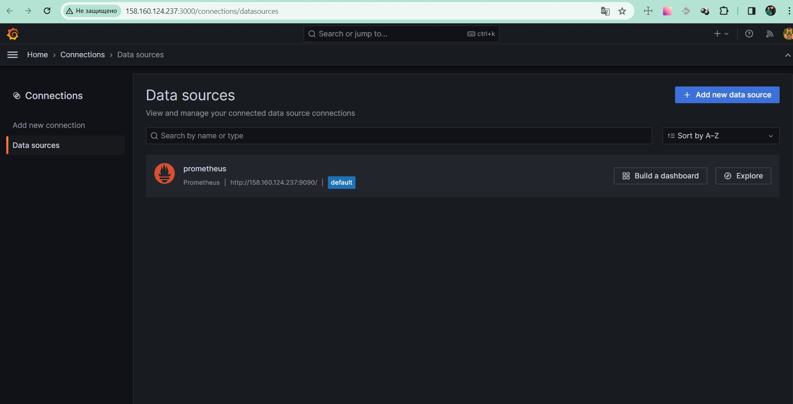

# Домашнее задание к занятию 14 «Средство визуализации Grafana»

1. Задание 1

2. Создайте Dashboard и в ней создайте Panels:

 - утилизация CPU для nodeexporter (в процентах, 100-idle);
 - CPULA 1/5/15;
 - количество свободной оперативной памяти;
 - количество места на файловой системе.

3. 