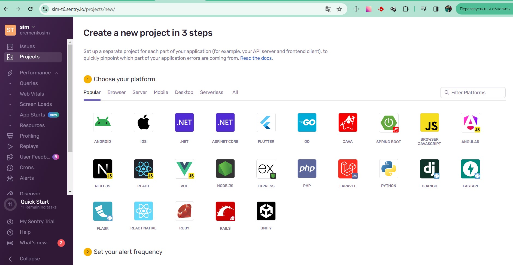

# Домашнее задание к занятию 16 «Платформа мониторинга Sentry»

### Задание 1

### Задание 2

Составлен скрипт с проверкой деления на ноль и исполнен

> Закрытая issue

### Задание 3

Сообщение на почте о срабатывании алерта

