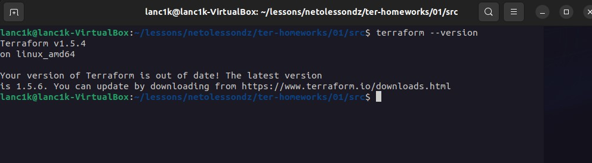
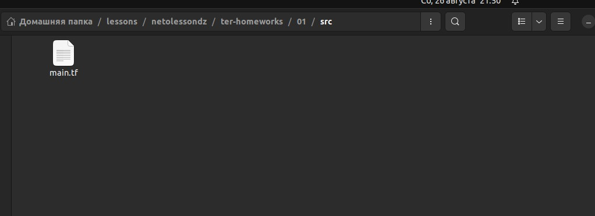
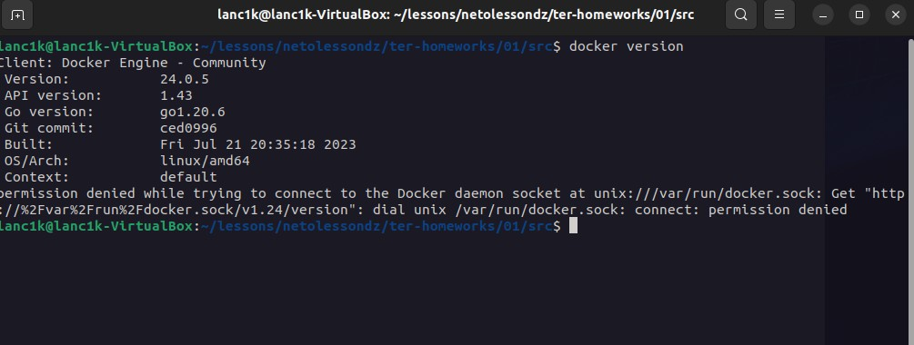
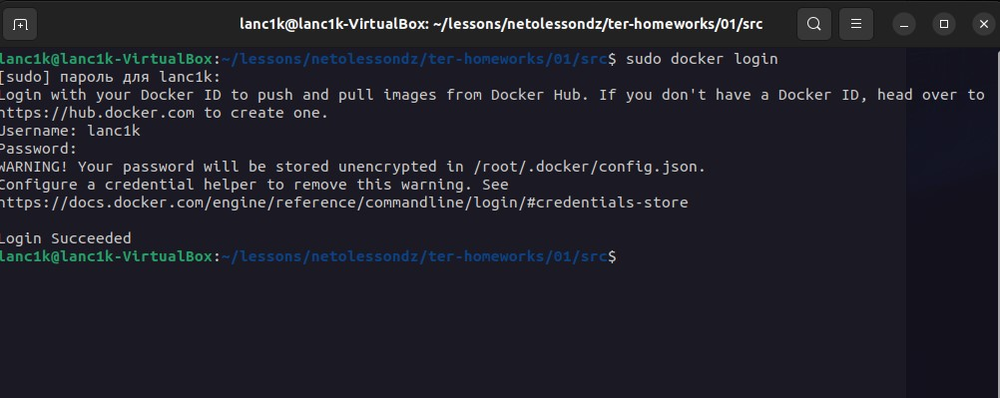
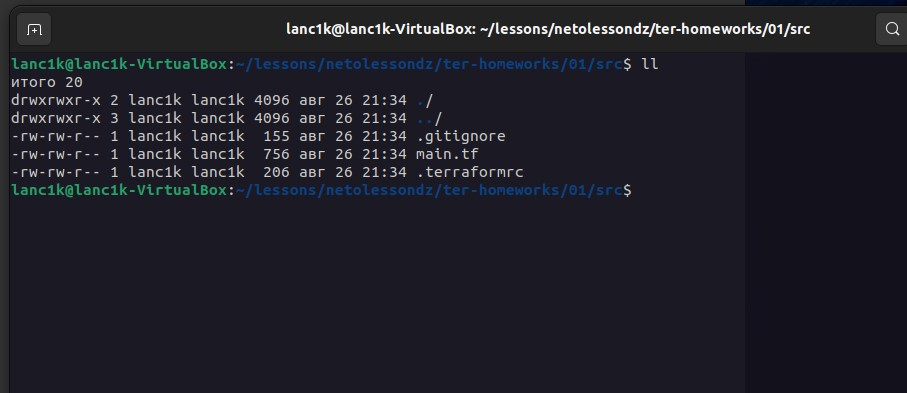
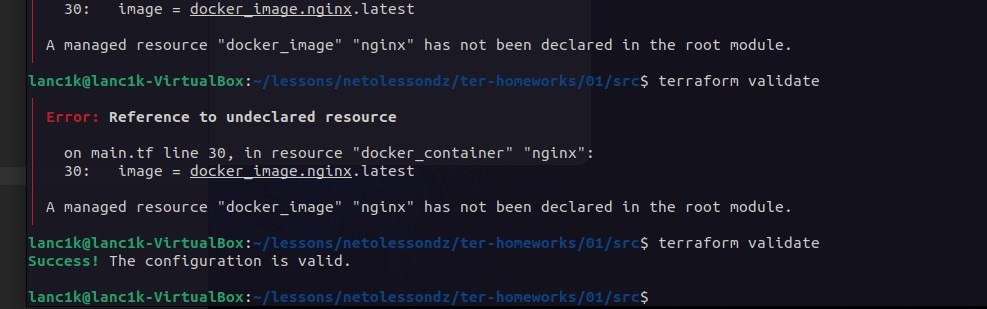
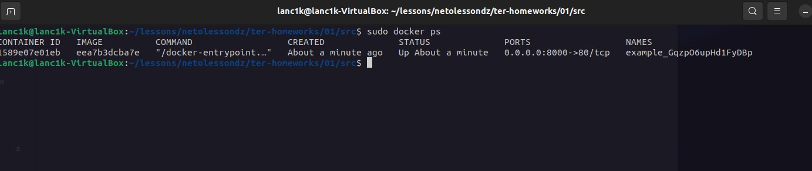
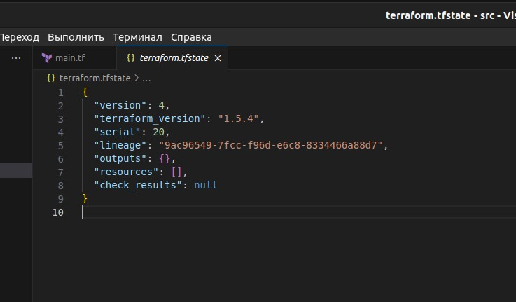

## Чек-лист готовности к домашнему заданию

1. Скачайте и установите актуальную версию Terraform >=1.4.X . Приложите скриншот вывода команды `terraform --version`.

2. Скачайте на свой ПК этот git-репозиторий. Исходный код для выполнения задания расположен в директории 01/src.

3. Убедитесь, что в вашей ОС установлен docker.

4. Зарегистрируйте аккаунт на сайте https://hub.docker.com/, выполните команду docker login и введите логин, пароль.

## Задание 1

1. Перейдите в каталог src. Скачайте все необходимые зависимости, использованные в проекте.

2. Изучите файл .gitignore. В каком terraform-файле, согласно этому .gitignore, допустимо сохранить личную, секретную информацию?

`personal.auto.tfvars`

3. Выполните код проекта. Найдите в state-файле секретное содержимое созданного ресурса random_password, пришлите в качестве ответа конкретный ключ и его значение.

`"result": "VUx8bs5p9KCzW2jY"`

4. Раскомментируйте блок кода, примерно расположенный на строчках 29–42 файла main.tf. Выполните команду terraform validate. Объясните, в чём заключаются намеренно допущенные ошибки. Исправьте их.

- В resource "docker_image" отсутсвовало имя
- В esource "docker_container" неверное имя, которое начиналось с цифры
- random_string_FAKE, лишний _FAKE
- В result буква Т была с большой буквы

5. Выполните код. В качестве ответа приложите вывод команды `docker ps`.

6. Замените имя docker-контейнера в блоке кода на hello_world. Не перепутайте имя контейнера и имя образа. Мы всё ещё продолжаем использовать name = "nginx:latest". Выполните команду terraform apply -auto-approve. Объясните своими словами, в чём может быть опасность применения ключа -auto-approve. В качестве ответа дополнительно приложите вывод команды docker ps.

- Опасность применения -auto-approve заключается в том, что команда terraform apply разворачивает ресурсы без моего подтверждения и дестроит docker-контейнер имеющийся. Есть риск "убить" лишнее.

7. Уничтожьте созданные ресурсы с помощью terraform. Убедитесь, что все ресурсы удалены. Приложите содержимое файла terraform.tfstate.

8. Объясните, почему при этом не был удалён docker-образ nginx:latest. Ответ подкрепите выдержкой из документации провайдера docker.

Он не был удалён, потому что мы использовали уже ранее скаченный image и просто переименовали имя контейнера.

`Resource (docker_image)Pulls a Docker image to a given Docker host from a Docker Registry. This resource will not pull new layers of the image automatically unless used in conjunction with docker_registry_image data source to update the pull_triggers field`