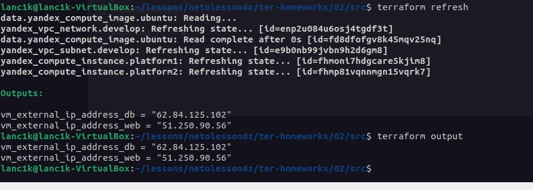

## Задание 1

4. Инициализируйте проект, выполните код. Исправьте намеренное допущенные ошибки. Ответьте в чем заключается их суть?

`Error: Error while requesting API to create instance: server-request-id = 486c310b-9ff2-4004-9bea-f739813d8d03 server-trace-id = 923650425d557910:f88af0538d4a8896:923650425d557910:1 client-request-id = ab0baf0c-a5cb-4833-bf1c-86fff98ea8cd client-trace-id = e510d6ef-c87d-406f-9b30-345838bed697 rpc error: code = FailedPrecondition desc = Platform "standart-v4" not found`

Ошибка говорит о том, что платформы standart-v4 не найдено.

После изменения на standart-v3 выдана ошибка `Error while requesting API to create instance: server-request-id = 76b74df5-8b32-4fa9-b93c-b3e232858470 server-trace-id = a3256493a3fd909c:e555c5bac668c6d0:a3256493a3fd909c:1 client-request-id = 7e5c4ef4-2218-4e26-ae5e-c646c65dceb8 client-trace-id = aa445036-789a-4da0-8f84-274ed50937cb rpc error: code = InvalidArgument desc = the specified core fraction is not available on platform "standard-v3"; allowed core fractions: 20, 50, 100` говорящая о том, что core_fraction должно быть равным 20, 50, 100

Следующая ошибка `Error while requesting API to create instance: server-request-id = a2620594-a7b1-4755-ae83-f52ace16d265 server-trace-id = 5f9bd11b1d31925d:76f8766466c45f5:5f9bd11b1d31925d:1 client-request-id = 692f6d4c-9043-47d0-a399-c75eb65d8ce2 client-trace-id = ecd77cbc-2d0e-4750-b172-5f0d39b97bc9 rpc error: code = InvalidArgument desc = the specified number of cores is not available on platform "standard-v3"; allowed core number: 2, 4` говорит, что CPU должно быть 2 или 4

5. Ответьте, как в процессе обучения могут пригодиться параметры `preemptible = true` и `core_fraction=5` в параметрах ВМ? Ответ в документации Yandex cloud.

`preemptible = true` позволяет останавливать созданные виртуальные машины. `core_fraction=5` виртуальные машины с уровнем производительности меньше 100% предназначены для запуска приложений, не требующих высокой производительности и не чувствительных к задержкам. Настройки помогают нам экономить денежные средства.

## Задание 4

1. Объявите в файле outputs.tf output типа map, содержащий { instance_name = external_ip } для каждой из ВМ.
Примените изменения.
2. В качестве решения приложите вывод значений ip-адресов команды terraform output.

