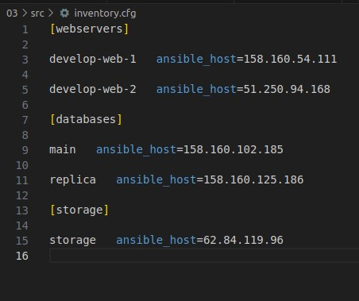

## Задание 1

1. Изучите проект.
2. Заполните файл personal.auto.tfvars.
3. Инициализируйте проект, выполните код. Он выполнится, даже если доступа к preview нет.
Примечание. Если у вас не активирован preview-доступ к функционалу «Группы безопасности» в Yandex Cloud, запросите доступ у поддержки облачного провайдера. Обычно его выдают в течение 24-х часов.

Приложите скриншот входящих правил «Группы безопасности» в ЛК Yandex Cloud или скриншот отказа в предоставлении доступа к preview-версии.


## Задание 2

1. Создайте файл count-vm.tf. Опишите в нём создание двух одинаковых ВМ web-1 и web-2 (не web-0 и web-1) с минимальными параметрами, используя мета-аргумент count loop. Назначьте ВМ созданную в первом задании группу безопасности.(как это сделать узнайте в документации провайдера yandex/compute_instance )

```
resource "yandex_compute_instance" "web" {
  count = 2
  name  = "develop-web-${count.index + 1}"
  resources {
    cores         = 2
    memory        = 1
    core_fraction = 5
  }
  boot_disk {
    initialize_params {
      image_id = "fd8tcjmhffpii4v6m09d"
    }
  }
  # scheduling_policy {
  #   preemptible = true
  # }
  network_interface {
    subnet_id = yandex_vpc_subnet.develop.id
    nat       = true
  }
  metadata = {
    ssh-keys = local.ssh
  }
}
```

2. Создайте файл for_each-vm.tf. Опишите в нём создание двух ВМ с именами "main" и "replica" разных по cpu/ram/disk , используя мета-аргумент for_each loop. Используйте для обеих ВМ одну общую переменную типа list(object({ vm_name=string, cpu=number, ram=number, disk=number })). При желании внесите в переменную все возможные параметры.

```
resource "yandex_compute_instance" "forech_bm" {
  depends_on  = [yandex_compute_instance.web]
  for_each    = local.vm_foreach
  name        = each.key
  platform_id = var.vm_platform_id
  resources {
    cores         = each.value.cpu
    memory        = each.value.memory
    core_fraction = each.value.core_fraction
  }

  boot_disk {
    initialize_params {
      image_id = "fd8tcjmhffpii4v6m09d"
    }
  }

  network_interface {
    subnet_id = yandex_vpc_subnet.develop.id
    nat       = true
  }

  metadata = {
    ssh-keys = local.ssh
  }
}
```

3. ВМ из пункта 2.2 должны создаваться после создания ВМ из пункта 2.1.

`depends_on  = [yandex_compute_instance.web]`

4. Используйте функцию file в local-переменной для считывания ключа ~/.ssh/id_rsa.pub и его последующего использования в блоке metadata, взятому из ДЗ 2.

```
locals {
  ssh = "ubuntu:${file("~/.ssh/id_ed25519.pub")}"
}
```

## Задание 3

1. Создайте 3 одинаковых виртуальных диска размером 1 Гб с помощью ресурса yandex_compute_disk и мета-аргумента count в файле disk_vm.tf .
2. Создайте в том же файле одиночную(использовать count или for_each запрещено из-за задания №4) ВМ c именем "storage" . Используйте блок dynamic secondary_disk{..} и мета-аргумент for_each для подключения созданных вами дополнительных дисков.

```
resource "yandex_compute_disk" "disks" {
  count = 3
  name  = "disk-${count.index + 1}"
  size  = 1
}

resource "yandex_compute_instance" "storage" {
  name = "storage"
  resources {
    cores         = 2
    memory        = 2
    core_fraction = 20
  }

  boot_disk {
    initialize_params {
      image_id = "fd8tcjmhffpii4v6m09d"
    }
  }

  dynamic "secondary_disk" {
    for_each = yandex_compute_disk.disks.*.id
    content {
      disk_id = yandex_compute_disk.disks["${secondary_disk.key}"].id
    }
  }

  network_interface {
    subnet_id = yandex_vpc_subnet.develop.id
    nat       = true
  }

  metadata = {
    ssh-keys = local.ssh
  }
}
```

## Задание 4

1. В файле ansible.tf создайте inventory-файл для ansible. Используйте функцию tepmplatefile и файл-шаблон для создания ansible inventory-файла из лекции. Готовый код возьмите из демонстрации к лекции demonstration2. Передайте в него в качестве переменных группы виртуальных машин из задания 2.1, 2.2 и 3.2, т. е. 5 ВМ.
2. Инвентарь должен содержать 3 группы [webservers], [databases], [storage] и быть динамическим, т. е. обработать как группу из 2-х ВМ, так и 999 ВМ.
3. Выполните код. Приложите скриншот получившегося файла.

ansible.tf

```
resource "local_file" "inventory_cfg" {
  content = templatefile("${path.module}/inventory.tftpl",
    {
      webservers       = yandex_compute_instance.web,
      fe_instance      = yandex_compute_instance.forech_bm,
      storage_instance = [yandex_compute_instance.storage]
    }
  )

  filename = "${abspath(path.module)}/inventory.cfg"
}

resource "null_resource" "web_hosts_provision" {
  #Ждем создания инстанса
  depends_on = [yandex_compute_instance.storage, local_file.inventory_cfg]

  #Добавление ПРИВАТНОГО ssh ключа в ssh-agent
  /*provisioner "local-exec" {
    command = "cat ~/.ssh/id_rsa | ssh-add -"
  }*/

  #Костыль!!! Даем ВМ 60 сек на первый запуск. Лучше выполнить это через wait_for port 22 на стороне ansible
  # В случае использования cloud-init может потребоваться еще больше времени
  provisioner "local-exec" {
    command = "sleep 60"
  }

  #Запуск ansible-playbook
  provisioner "local-exec" {
    command     = "export ANSIBLE_HOST_KEY_CHECKING=False; ansible-playbook -i ${abspath(path.module)}/inventory.cfg ${abspath(path.module)}/test.yml"
    on_failure  = continue #Продолжить выполнение terraform pipeline в случае ошибок
    environment = { ANSIBLE_HOST_KEY_CHECKING = "False" }
    #срабатывание триггера при изменении переменных
  }
  triggers = {
    always_run        = "${timestamp()}"                         #всегда т.к. дата и время постоянно изменяются
    playbook_src_hash = file("${abspath(path.module)}/test.yml") # при изменении содержимого playbook файла
    ssh_public_key    = local.ssh                                # при изменении переменной
  }

}
```

inventory.tftpl

```
[webservers]

%{~ for i in webservers ~}
%{ if "${i["network_interface"][0]["nat"]}" != false }
${i["name"]}   ansible_host=${i["network_interface"][0]["nat_ip_address"]}
%{ else }
${i["name"]}   ansible_host=${i["network_interface"][0]["ip_address"]}
%{ endif}
%{~ endfor ~}

[databases]

%{~ for i in fe_instance ~}
%{ if "${i["network_interface"][0]["nat"]}" != false }
${i["name"]}   ansible_host=${i["network_interface"][0]["nat_ip_address"]}
%{ else }
${i["name"]}   ansible_host=${i["network_interface"][0]["ip_address"]}
%{ endif}
%{~ endfor ~}

[storage]

%{~ for i in storage_instance ~}
  %{ if "${i["network_interface"][0]["nat"]}" != false }
${i["name"]}   ansible_host=${i["network_interface"][0]["nat_ip_address"]}
%{ else }
${i["name"]}   ansible_host=${i["network_interface"][0]["ip_address"]}
%{ endif}
%{~ endfor ~}
```

inventory.cfg

